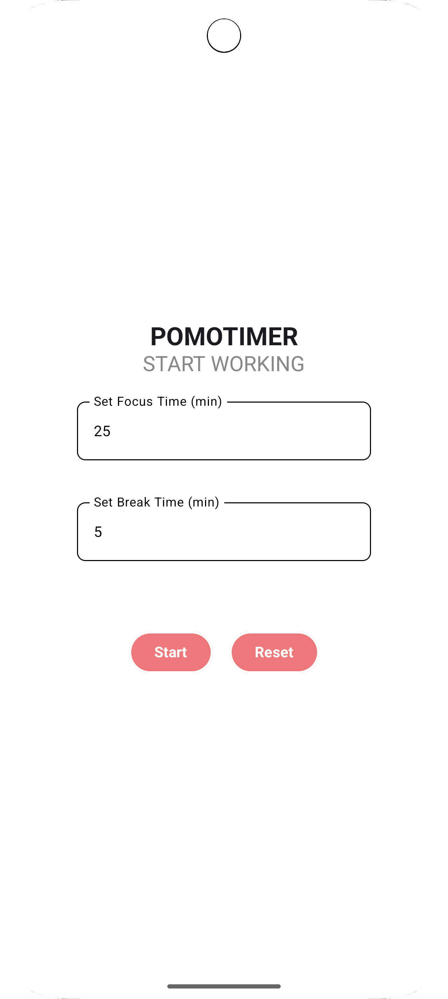

# 📱 PomoApp

A simple, beautiful Pomodoro timer built with **Jetpack Compose** for Android.  
Helps you stay productive by managing your work and break sessions effectively.

---

## ✨ Features

- ⏱️ **Custom Focus Time**: Set your desired focus (work) duration.
- ☕ **Custom Break Time**: Set your desired break duration (limited to be shorter than focus time).
- 🔁 **Automatic Mode Switching**: Switches automatically between focus and break modes.
- 🛎️ **Vibration Alert**: Vibrates your phone when a session ends.
- 📈 **Session Counter**: Tracks the number of completed work sessions.
- 🎨 **Modern UI**: Smooth and minimalistic user interface built entirely with **Jetpack Compose**.

---

## 📸 Screenshots

 

---

